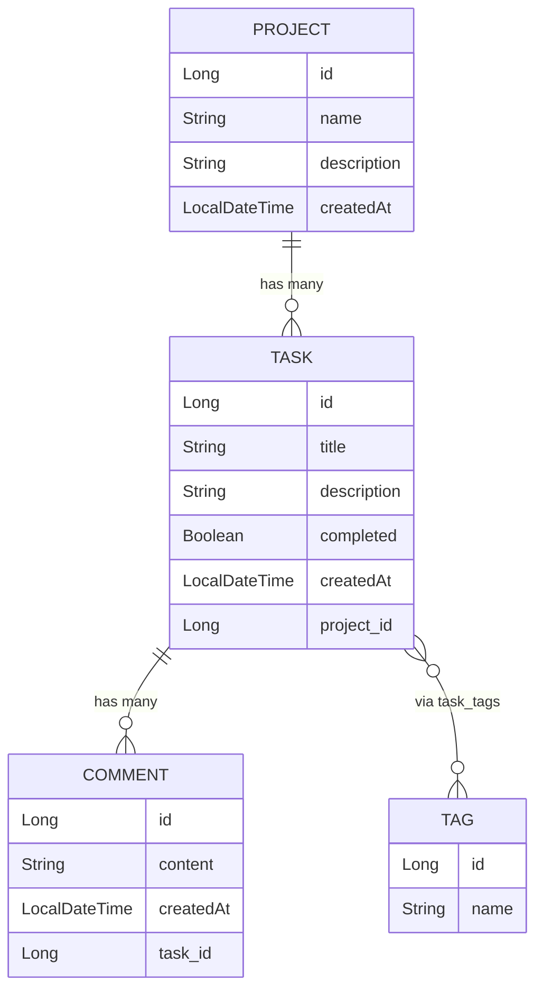

# Many-to-Many: Task ↔ Tag

## @ManyToMany and Join Tables

---

# The Relationship

A task can have many tags. A tag can apply to many tasks.

```
Tag: "backend"   → Task 1, Task 3
Tag: "urgent"    → Task 2
Tag: "review"    → Task 1, Task 2, Task 4
```

This requires a **join table** — a third table that stores the pairs.

```sql
CREATE TABLE task_tags (
    task_id  BIGINT REFERENCES tasks(id),
    tag_id   BIGINT REFERENCES tags(id),
    PRIMARY KEY (task_id, tag_id)
);
```

---

# Tag.java

```java
package com.chetraseng.sunrise_task_flow_api.model;

import jakarta.persistence.*;
import lombok.*;

@Entity
@Table(name = "tags")
@Data
@NoArgsConstructor
@AllArgsConstructor
@Builder
public class Tag {

    @Id
    @GeneratedValue(strategy = GenerationType.IDENTITY)
    private Long id;

    @Column(unique = true, nullable = false)
    private String name;
}
```

---
zoom: 0.8
---

# Update Task.java — Add Tags

```java
@Entity
@Table(name = "tasks")
@Data @NoArgsConstructor @AllArgsConstructor @Builder
public class Task {

    @Id
    @GeneratedValue(strategy = GenerationType.IDENTITY)
    private Long id;

    private String title;
    private String description;
    private Boolean completed = false;

    @CreationTimestamp
    private LocalDateTime createdAt;

    @ManyToOne
    @JoinColumn(name = "project_id")
    private Project project;

    @ManyToMany
    @JoinTable(
        name = "task_tags",
        joinColumns = @JoinColumn(name = "task_id"),
        inverseJoinColumns = @JoinColumn(name = "tag_id")
    )
    private List<Tag> tags = new ArrayList<>();    // ← new
}
```

---
zoom: 0.85
---

# @JoinTable Explained

```java
@ManyToMany
@JoinTable(
    name = "task_tags",               // the join table name in the DB
    joinColumns = @JoinColumn(name = "task_id"),         // FK to THIS entity (Task)
    inverseJoinColumns = @JoinColumn(name = "tag_id")    // FK to OTHER entity (Tag)
)
private List<Tag> tags;
```

<v-click>

JPA creates this SQL schema:
```sql
CREATE TABLE task_tags (
    task_id BIGINT REFERENCES tasks(id),
    tag_id  BIGINT REFERENCES tags(id),
    PRIMARY KEY (task_id, tag_id)
);
```

</v-click>

---

# TagRepository

```java
package com.chetraseng.sunrise_task_flow_api.repository;

import com.chetraseng.sunrise_task_flow_api.model.Tag;
import org.springframework.data.jpa.repository.JpaRepository;
import java.util.Optional;

public interface TagRepository extends JpaRepository<Tag, Long> {

    Optional<Tag> findByName(String name);

}
```

```sql
-- findByName("urgent"):
SELECT * FROM tags WHERE name = 'urgent'
```

---

# Attaching a Tag to a Task

```java
// In a TagService or TaskTagService:
@Transactional
public void attachTag(Long taskId, Long tagId) {
    Task task = taskRepository.findById(taskId)
        .orElseThrow(() -> new ResponseStatusException(HttpStatus.NOT_FOUND));

    Tag tag = tagRepository.findById(tagId)
        .orElseThrow(() -> new ResponseStatusException(HttpStatus.NOT_FOUND));

    task.getTags().add(tag);
    taskRepository.save(task);   // ← saves the join table row
}
```

```sql
-- JPA runs:
INSERT INTO task_tags (task_id, tag_id) VALUES (1, 2);
```

---

# Querying Tasks by Tag

```java
// TaskRepository — find tasks with a specific tag:
public interface TaskRepository extends JpaRepository<Task, Long> {

    List<Task> findByCompleted(boolean completed);
    List<Task> findByProjectId(Long projectId);

    @Query("SELECT t FROM Task t JOIN t.tags tag WHERE tag.name = :tagName")
    List<Task> findByTagName(@Param("tagName") String tagName);
}
```

```sql
-- Generated SQL:
SELECT t.* FROM tasks t
JOIN task_tags tt ON t.id = tt.task_id
JOIN tags tag ON tt.tag_id = tag.id
WHERE tag.name = 'urgent'
```

---

# Bridge: HashMap&lt;Long, Set&lt;Long&gt;&gt; → @ManyToMany

```java
// Before (Phase 1): manual junction with in-memory Map
private Map<Long, Set<Long>> taskTags = new ConcurrentHashMap<>();
taskTags.computeIfAbsent(taskId, k -> new HashSet<>()).add(tagId);

// After (JPA): @ManyToMany manages the join table
task.getTags().add(tag);
taskRepository.save(task);
// → INSERT INTO task_tags (task_id, tag_id) VALUES (?, ?)
```

The logic is the same. JPA manages the join table automatically.

---

# Full Entity Relationship Diagram

<Transform :scale="0.45" class="text-center">



</Transform>

---

# Relationships Summary

| From | To | Annotation (owning side) | SQL |
|------|----|--------------------------|-----|
| Task | Project | `@ManyToOne @JoinColumn(project_id)` | FK column in tasks |
| Project | Task | `@OneToMany(mappedBy="project")` | no new column |
| Comment | Task | `@ManyToOne @JoinColumn(task_id)` | FK column in comments |
| Task | Comment | `@OneToMany(mappedBy="task")` | no new column |
| Task | Tag | `@ManyToMany @JoinTable(task_tags)` | join table |
