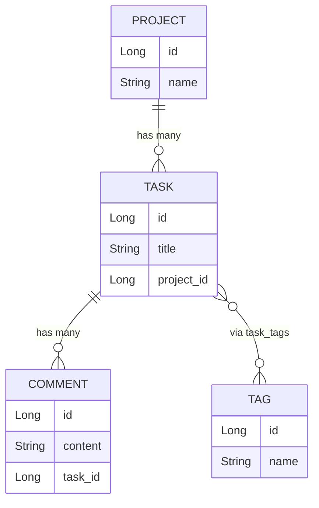

# JPA Relationships

## Project, Comments, and Tags

---

# Relationships in SQL — A Quick Recap

We already know how to link tables in SQL:

```sql
-- A task belongs to a project
CREATE TABLE tasks (
    id          BIGSERIAL PRIMARY KEY,
    title       VARCHAR(255),
    project_id  BIGINT REFERENCES projects(id)  -- foreign key
);

-- A comment belongs to a task
CREATE TABLE comments (
    id       BIGSERIAL PRIMARY KEY,
    content  TEXT,
    task_id  BIGINT REFERENCES tasks(id)
);

-- Many tasks can have many tags (join table)
CREATE TABLE task_tags (
    task_id  BIGINT REFERENCES tasks(id),
    tag_id   BIGINT REFERENCES tags(id)
);
```

**JPA maps these exact relationships using annotations.** You write Java — Hibernate creates the SQL.

---

# The Three Relationships We'll Add

<Transform :scale="0.6">



</Transform>

| Relationship | JPA | SQL |
|---|---|---|
| Project → Task | `@OneToMany` / `@ManyToOne` | `project_id` FK in tasks |
| Task → Comment | `@OneToMany` / `@ManyToOne` | `task_id` FK in comments |
| Task ↔ Tag | `@ManyToMany` | `task_tags` join table |

---
layout: center
---

# Part 1 — Project → Task

## One Project Has Many Tasks

---
zoom: 0.85
---

# Create ProjectModel.java

```java
package com.chetraseng.sunrise_task_flow_api.model;

import jakarta.persistence.*;
import lombok.*;
import org.hibernate.annotations.CreationTimestamp;
import java.time.LocalDateTime;
import java.util.List;

@Entity
@Table(name = "projects")
@Data
@NoArgsConstructor
@AllArgsConstructor
@Builder
public class ProjectModel {

    @Id
    @GeneratedValue(strategy = GenerationType.IDENTITY)
    private Long id;

    private String name;
    private String description;

    @CreationTimestamp
    private LocalDateTime createdAt;

    @OneToMany(mappedBy = "project", cascade = CascadeType.ALL)
    private List<TaskModel> tasks;
}
```

---

# @OneToMany Explained

```java
@OneToMany(mappedBy = "project", cascade = CascadeType.ALL)
private List<TaskModel> tasks;
```

| Part | What It Means |
|------|--------------|
| `@OneToMany` | One Project → many Tasks |
| `mappedBy = "project"` | Task.java owns the FK — look there for `project_id` |
| `cascade = CascadeType.ALL` | Deleting a project also deletes its tasks |

<v-click>

**SQL equivalent:**
```sql
SELECT * FROM tasks WHERE project_id = ?
```

</v-click>

---
zoom: 0.85
---

# Update TaskModel.java — Add the Project FK

Add one field to `TaskModel.java`:

```java
@Entity
@Table(name = "tasks")
@Data
@NoArgsConstructor
@AllArgsConstructor
@Builder
public class TaskModel {

    @Id
    @GeneratedValue(strategy = GenerationType.IDENTITY)
    private Long id;

    private String title;
    private String description;
    private Boolean completed = false;

    @CreationTimestamp
    private LocalDateTime createdAt;

    @ManyToOne
    @JoinColumn(name = "project_id")
    private ProjectModel project;
}
```

---

# @ManyToOne + @JoinColumn Explained

```java
@ManyToOne
@JoinColumn(name = "project_id")
private ProjectModel project;
```

| Annotation | SQL Equivalent |
|------------|---------------|
| `@ManyToOne` | Many tasks belong to one project |
| `@JoinColumn(name = "project_id")` | Creates column `project_id` in the `tasks` table |

<v-click>

```sql
-- Hibernate generates:
ALTER TABLE tasks ADD COLUMN project_id BIGINT;
ALTER TABLE tasks ADD CONSTRAINT fk_task_project
    FOREIGN KEY (project_id) REFERENCES projects(id);
```

</v-click>

---

# Query Tasks by Project

Add to `TaskRepository`:

```java
public interface TaskRepository extends JpaRepository<TaskModel, Long> {
    List<TaskModel> findByCompleted(boolean completed);

    // Find all tasks for a project
    List<TaskModel> findByProject(ProjectModel project);

    // Or just use the project ID
    List<TaskModel> findByProjectId(Long projectId);
}
```

```sql
-- Generated by findByProjectId(1L):
SELECT * FROM tasks WHERE project_id = 1
```

---
layout: center
---

# Part 2 — Task → Comment

## One Task Has Many Comments

---
zoom: 0.85
---

# Create CommentModel.java

```java
package com.chetraseng.sunrise_task_flow_api.model;

import jakarta.persistence.*;
import lombok.*;
import org.hibernate.annotations.CreationTimestamp;
import java.time.LocalDateTime;

@Entity
@Table(name = "comments")
@Data
@NoArgsConstructor
@AllArgsConstructor
@Builder
public class CommentModel {

    @Id
    @GeneratedValue(strategy = GenerationType.IDENTITY)
    private Long id;

    private String content;

    @CreationTimestamp
    private LocalDateTime createdAt;

    @ManyToOne
    @JoinColumn(name = "task_id")
    private TaskModel task;
}
```

---

# Update TaskModel.java — Add Comments

Add the comments list to `TaskModel.java`:

```java
@Entity
@Table(name = "tasks")
@Data
@NoArgsConstructor
@AllArgsConstructor
@Builder
public class TaskModel {

    // ... existing fields ...

    @OneToMany(mappedBy = "task", cascade = CascadeType.ALL, orphanRemoval = true)
    private List<CommentModel> comments;
}
```

<v-click>

`orphanRemoval = true` — if you remove a comment from the list, Hibernate deletes it from the DB.

```sql
-- Hibernate generates:
DELETE FROM comments WHERE id = ? AND task_id = ?
```

</v-click>

---

# Comment Repository

```java
package com.chetraseng.sunrise_task_flow_api.repository;

import com.chetraseng.sunrise_task_flow_api.model.CommentModel;
import org.springframework.data.jpa.repository.JpaRepository;
import java.util.List;

public interface CommentRepository extends JpaRepository<CommentModel, Long> {

    List<CommentModel> findByTaskId(Long taskId);

}
```

```sql
-- Generated by findByTaskId(1L):
SELECT * FROM comments WHERE task_id = 1
```

---
layout: center
---

# Part 3 — Task ↔ Tag

## Many Tasks, Many Tags

---

# Create TagModel.java

```java
package com.chetraseng.sunrise_task_flow_api.model;

import jakarta.persistence.*;
import lombok.*;

@Entity
@Table(name = "tags")
@Data
@NoArgsConstructor
@AllArgsConstructor
@Builder
public class TagModel {

    @Id
    @GeneratedValue(strategy = GenerationType.IDENTITY)
    private Long id;

    private String name;
}
```

---
zoom: 0.85
---

# Update TaskModel.java — Add Tags

```java
@Entity
@Table(name = "tasks")
@Data
@NoArgsConstructor
@AllArgsConstructor
@Builder
public class TaskModel {

    // ... existing fields ...

    @ManyToMany
    @JoinTable(
        name = "task_tags",
        joinColumns = @JoinColumn(name = "task_id"),
        inverseJoinColumns = @JoinColumn(name = "tag_id")
    )
    private List<TagModel> tags;
}
```

---
zoom: 0.85
---

# @ManyToMany + @JoinTable Explained

```java
@ManyToMany
@JoinTable(
    name = "task_tags",
    joinColumns = @JoinColumn(name = "task_id"),
    inverseJoinColumns = @JoinColumn(name = "tag_id")
)
private List<TagModel> tags;
```

| Part | What It Does |
|------|-------------|
| `@ManyToMany` | A task has many tags; a tag applies to many tasks |
| `@JoinTable(name = "task_tags")` | Creates the `task_tags` join table |
| `joinColumns = task_id` | The FK back to the owning side (Task) |
| `inverseJoinColumns = tag_id` | The FK to the other side (Tag) |

<v-click>

```sql
-- Hibernate generates:
CREATE TABLE task_tags (
    task_id BIGINT REFERENCES tasks(id),
    tag_id  BIGINT REFERENCES tags(id)
);
```

</v-click>

---

# Querying by Tag

Add to `TaskRepository`:

```java
public interface TaskRepository extends JpaRepository<TaskModel, Long> {
    List<TaskModel> findByCompleted(boolean completed);
    List<TaskModel> findByProjectId(Long projectId);

    // Find all tasks with a specific tag name
    List<TaskModel> findByTagsName(String tagName);
}
```

```sql
-- Generated by findByTagsName("urgent"):
SELECT t.* FROM tasks t
JOIN task_tags tt ON t.id = tt.task_id
JOIN tags tg ON tt.tag_id = tg.id
WHERE tg.name = 'urgent'
```

---

# Two Ways to Model Many-to-Many

Both produce the same `task_tags` table. The difference is how much control you want in Java.

<v-clicks>

**Approach 1 — `@ManyToMany`:** Spring manages the join table for you. Less code. No extra columns.
```sql
CREATE TABLE task_tags (
    task_id BIGINT REFERENCES tasks(id),
    tag_id  BIGINT REFERENCES tags(id)
);
```

**Approach 2 — Explicit join entity:** You own the join table as a real entity. More code. Full control.
```sql
CREATE TABLE task_tags (
    id          BIGSERIAL PRIMARY KEY,
    task_id     BIGINT REFERENCES tasks(id),
    tag_id      BIGINT REFERENCES tags(id),
    assigned_at TIMESTAMP DEFAULT NOW()   -- ← impossible with @ManyToMany
);
```

</v-clicks>

---
zoom: 0.85
---

# Approach 1 — @ManyToMany: Adding a Tag

```java
// TaskModel.java:
@ManyToMany
@JoinTable(
    name = "task_tags",
    joinColumns = @JoinColumn(name = "task_id"),
    inverseJoinColumns = @JoinColumn(name = "tag_id")
)
private List<TagModel> tags = new ArrayList<>();
```

```java
// Service — add a tag:
@Transactional
public void addTag(Long taskId, Long tagId) {
    TaskModel task = taskRepository.findById(taskId).orElseThrow();
    TagModel  tag  = tagRepository.findById(tagId).orElseThrow();

    task.getTags().add(tag);      // add to the list
    taskRepository.save(task);    // JPA syncs the join table
}
```

```sql
-- JPA runs:
INSERT INTO task_tags (task_id, tag_id) VALUES (1, 3);
```

---

# Approach 1 — @ManyToMany: Removing and Querying

```java
// Remove a tag:
@Transactional
public void removeTag(Long taskId, Long tagId) {
    TaskModel task = taskRepository.findById(taskId).orElseThrow();
    task.getTags().removeIf(tag -> tag.getId().equals(tagId));
    taskRepository.save(task);
}
```

```sql
DELETE FROM task_tags WHERE task_id = 1 AND tag_id = 3;
```

```java
// Read — direct access to the list:
List<TagModel> tags = task.getTags();
```

Direct and clean — but you can only see `id` and `name`. There's no way to know *when* or *by whom* the tag was added.

---

# Approach 1 — The Limitation

```java
// You want to know when each tag was assigned:
task.getTags()
// → [TagModel(id=1, name="urgent"), TagModel(id=3, name="backend")]
// → no assignedAt, no extra context — just the Tag object
```

<v-click>

`@ManyToMany` manages the join table as an invisible detail. You can't add columns to an invisible table.

If you ever need **anything beyond the two foreign keys**, you need Approach 2.

</v-click>

---
zoom: 0.85
---

# Approach 2 — Split Entity: TaskTagModel.java

```java
package com.chetraseng.sunrise_task_flow_api.model;

import jakarta.persistence.*;
import lombok.*;
import org.hibernate.annotations.CreationTimestamp;
import java.time.LocalDateTime;

@Entity
@Table(name = "task_tags")
@Data
@NoArgsConstructor
@AllArgsConstructor
@Builder
public class TaskTagModel {

    @Id
    @GeneratedValue(strategy = GenerationType.IDENTITY)
    private Long id;

    @ManyToOne
    @JoinColumn(name = "task_id")
    private TaskModel task;

    @ManyToOne
    @JoinColumn(name = "tag_id")
    private TagModel tag;

    @CreationTimestamp
    private LocalDateTime assignedAt;  // ← now you own this column
}
```

---

# Approach 2 — Update TaskModel.java

````md magic-move
```java
// Approach 1: @ManyToMany shortcut
@ManyToMany
@JoinTable(
    name = "task_tags",
    joinColumns = @JoinColumn(name = "task_id"),
    inverseJoinColumns = @JoinColumn(name = "tag_id")
)
private List<TagModel> tags = new ArrayList<>();
```

```java
// Approach 2: explicit join entity — you own the relationship
@OneToMany(mappedBy = "task", cascade = CascadeType.ALL, orphanRemoval = true)
private List<TaskTagModel> taskTags = new ArrayList<>();
```
````

The DB table is identical. In Java you now go through `TaskTagModel` instead of directly to `TagModel`.

---
zoom: 0.85
---

# Approach 2 — TaskTagRepository

```java
public interface TaskTagRepository extends JpaRepository<TaskTagModel, Long> {

    List<TaskTagModel> findByTaskId(Long taskId);
    List<TaskTagModel> findByTagId(Long tagId);

    boolean existsByTaskIdAndTagId(Long taskId, Long tagId);

    void deleteByTaskIdAndTagId(Long taskId, Long tagId);

}
```

---
zoom: 0.85
---

# Approach 2 — Adding and Removing a Tag

```java
// Add a tag:
@Transactional
public void addTag(Long taskId, Long tagId) {
    TaskModel task = taskRepository.findById(taskId).orElseThrow();
    TagModel  tag  = tagRepository.findById(tagId).orElseThrow();

    TaskTagModel link = TaskTagModel.builder()
        .task(task)
        .tag(tag)
        .build();  // assignedAt set by @CreationTimestamp

    taskTagRepository.save(link);
}
```

```java
// Remove a tag:
@Transactional
public void removeTag(Long taskId, Long tagId) {
    taskTagRepository.deleteByTaskIdAndTagId(taskId, tagId);
}
```

```sql
INSERT INTO task_tags (task_id, tag_id, assigned_at) VALUES (1, 3, NOW());
DELETE FROM task_tags WHERE task_id = 1 AND tag_id = 3;
```

---

# Approach 2 — Reading the Extra Data

```java
// All tags on a task — with metadata:
List<TaskTagModel> links = taskTagRepository.findByTaskId(taskId);

for (TaskTagModel link : links) {
    System.out.println(link.getTag().getName());      // "urgent"
    System.out.println(link.getAssignedAt());         // "2026-03-01T09:15:00"
}
```

```java
// Just the tag list (same as @ManyToMany result):
List<TagModel> tags = links.stream()
    .map(TaskTagModel::getTag)
    .toList();
```

The extra step through `TaskTagModel` is the price you pay — in return, you get full access to every column on the relationship.

---
zoom: 0.85
---

# Which Approach to Choose?

| | `@ManyToMany` | Explicit Join Entity |
|-|---------------|----------------------|
| Code amount | Less | More |
| Extra columns on join | ❌ Not possible | ✅ Any columns you want |
| Add a tag | `task.getTags().add(tag)` | `taskTagRepository.save(link)` |
| Remove a tag | `task.getTags().remove(tag)` | `taskTagRepository.deleteBy...()` |
| Read tags | `task.getTags()` | `.stream().map(::getTag)` |
| Best for | Simple label/category tagging | Auditable, enriched relationships |

<v-click>

**Rule of thumb:** start with `@ManyToMany`. If you ever need to store *when*, *by whom*, or *any metadata* about the relationship — switch to the explicit join entity.

</v-click>

---
zoom: 0.7
---

# Full TaskModel.java After All Relationships

```java
@Entity
@Table(name = "tasks")
@Data
@NoArgsConstructor
@AllArgsConstructor
@Builder
public class TaskModel {

    @Id
    @GeneratedValue(strategy = GenerationType.IDENTITY)
    private Long id;

    private String title;
    private String description;
    private Boolean completed = false;

    @CreationTimestamp
    private LocalDateTime createdAt;

    @ManyToOne
    @JoinColumn(name = "project_id")
    private ProjectModel project;

    @OneToMany(mappedBy = "task", cascade = CascadeType.ALL, orphanRemoval = true)
    private List<CommentModel> comments;

    @ManyToMany
    @JoinTable(name = "task_tags",
        joinColumns = @JoinColumn(name = "task_id"),
        inverseJoinColumns = @JoinColumn(name = "tag_id"))
    private List<TagModel> tags;
}
```

---

# What the Database Looks Like Now

```sql
-- Hibernate creates all these tables from your Java code:

CREATE TABLE projects (id BIGSERIAL PRIMARY KEY, name VARCHAR(255), ...);
CREATE TABLE tasks    (id BIGSERIAL PRIMARY KEY, ..., project_id BIGINT REFERENCES projects(id));
CREATE TABLE comments (id BIGSERIAL PRIMARY KEY, content TEXT, task_id BIGINT REFERENCES tasks(id));
CREATE TABLE tags     (id BIGSERIAL PRIMARY KEY, name VARCHAR(255));
CREATE TABLE task_tags (task_id BIGINT REFERENCES tasks(id), tag_id BIGINT REFERENCES tags(id));
```

You wrote Java. Hibernate wrote SQL.

---

# One Caution: Lazy Loading

By default, JPA uses **lazy loading** — it doesn't fetch related entities until you access them.

```java
TaskModel task = taskRepository.findById(1L).get();
// SQL: SELECT * FROM tasks WHERE id = 1

task.getComments();  // ← triggers a second query HERE
// SQL: SELECT * FROM comments WHERE task_id = 1
```

<v-click>

This is fine for most cases. But if you access a lazy-loaded collection **outside a transaction**, you'll get a `LazyInitializationException`.

**Fix:** either keep access inside `@Transactional` service methods, or use `FetchType.EAGER` (use sparingly).

</v-click>

---

# Relationship Summary

| Relationship | In Java | In SQL |
|---|---|---|
| `@ManyToOne` on Task | Task has a `project` field | `project_id` FK column in `tasks` |
| `@OneToMany` on Project | Project has a `tasks` list | Points back to `project_id` |
| `@ManyToOne` on Comment | Comment has a `task` field | `task_id` FK column in `comments` |
| `@OneToMany` on Task | Task has a `comments` list | Points back to `task_id` |
| `@ManyToMany` on Task | Task has a `tags` list | `task_tags` join table |

Every JPA relationship annotation maps to SQL you already know.
